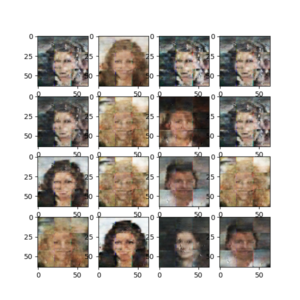

# Deep Convolution Generative Adversarial Networks

This repository is an implementation of DCGAN's that utilize convolution layers in their network architecture to produce images and learn mappings from 1x100 dimenssional latent space to target images. The power of these networks to learn connections within this latent space is also admirable.

We ran this model on three datasets:

1. CelebA Dataset: http://mmlab.ie.cuhk.edu.hk/projects/CelebA.html
2. Simpsons Dataset: https://www.kaggle.com/kostastokis/simpsons-faces
3. Simplified Simpsons Dataset: https://www.kaggle.com/kostastokis/simpsons-faces

To make the training easier, we downsized the images to 64x64 for datasets 1 and 3 and 128x128 for dataset 2.

Link to the original paper: https://arxiv.org/abs/1511.06434

## Results

After 50000 epochs, the samples from CelebA dataset

